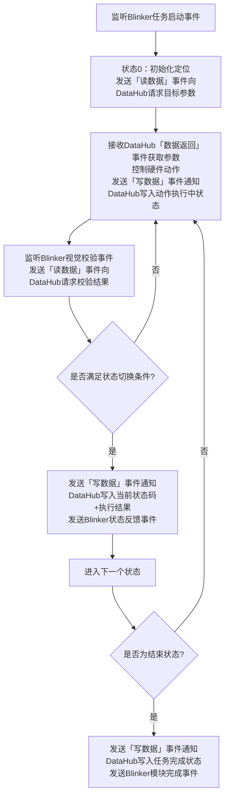
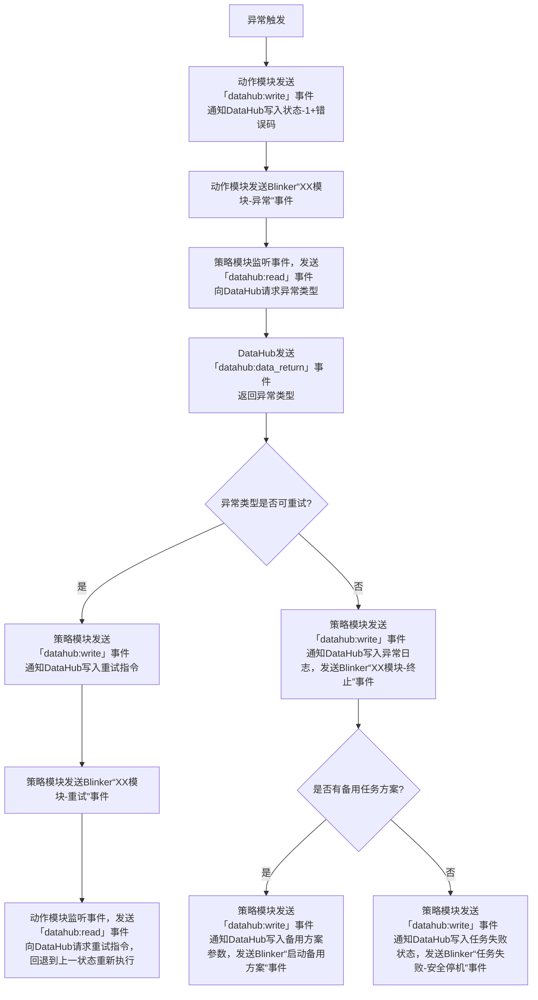

# RoboGame 机器人方块任务控制系统技术文档
## 1. 文档概述
### 1.1 文档目的
本文档为RoboGame竞赛中机器人方块收集-放置-搭建任务的**控制策略与执行系统**提供完整技术设计说明，明确系统架构、模块职责、状态流转逻辑、基于DataHub+Blinker的通信交互规则与异常处理机制，为算法实现、硬件调试与竞赛落地提供规范依据。

### 1.2 适用范围
本文档适用于RoboGame竞赛中以树莓派为主控的方块任务机器人，覆盖从环境感知、决策控制到动作执行的全流程控制逻辑，核心聚焦基于“DataHub数据中心+Blinker消息总线”的通信架构落地，仅针对本次竞赛的方块类任务场景。

### 1.3 术语定义
| 术语 | 定义 |
|------|------|
| 树莓派策略模块 | 系统主控单元，运行核心决策算法，负责任务调度、状态机管理与模块协同控制，通过Blinker发送/监听事件与DataHub交互数据 |
| 视觉模块 | 环境感知单元，负责图像采集、目标识别与位姿反馈，通过Blinker发送事件通知DataHub写入数据，或接收DataHub返回的读取数据 |
| 动作执行模块 | 包含收集方块、放置方块、搭建方块三个子模块，负责机械动作执行与状态反馈，通过Blinker发送事件通知DataHub写入/读取数据 |
| 有限状态机（FSM） | 控制任务流程的核心模型，通过状态切换管理任务阶段流转 |
| 状态码 | 定义任务执行阶段的标识（0/1/2/3/-1），用于状态流转与反馈 |
| DataHub数据中心 | 全局共享数据的唯一管理单元，封装线程锁，**仅通过Blinker事件触发内部数据读写**，提供线程安全的数据存储能力 |
| Blinker消息总线 | 模块间事件通信的核心载体，基于事件驱动模式实现模块解耦，是DataHub与所有业务模块的唯一数据交互通道 |

## 2. 系统整体架构
本系统采用**“感知-决策-执行-反馈”的分层闭环控制架构**，并基于“DataHub数据中心+Blinker消息总线”实现模块解耦与线程安全通信（所有模块与DataHub的交互均通过Blinker事件触发），整体架构如下：

```mermaid
graph LR
    A[视觉模块<br/>(感知层)] -->|发送「写数据」事件| B[Blinker消息总线<br/>(通信层)]
    B -->|监听「写数据」事件| D[DataHub数据中心<br/>(数据层)]
    A -->|发送「读数据」事件| B
    B -->|监听「读数据」事件| D
    D -->|发送「数据返回」事件| B
    B -->|监听「数据返回」事件| A

    B -->|监听事件| C[树莓派策略模块<br/>(决策层)]
    C -->|发送「写数据」事件| B
    B -->|监听「写数据」事件| D
    C -->|发送「读数据」事件| B
    B -->|监听「读数据」事件| D
    D -->|发送「数据返回」事件| B
    B -->|监听「数据返回」事件| C

    B -->|监听指令事件| E[收集方块模块<br/>(执行层)]
    B -->|监听指令事件| F[放置方块模块<br/>(执行层)]
    B -->|监听指令事件| G[搭建方块模块<br/>(执行层)]
    
    E -->|发送「写数据」事件| B
    B -->|监听「写数据」事件| D
    E -->|发送「读数据」事件| B
    B -->|监听「读数据」事件| D
    D -->|发送「数据返回」事件| B
    B -->|监听「数据返回」事件| E

    F -->|发送「写数据」事件| B
    B -->|监听「写数据」事件| D
    F -->|发送「读数据」事件| B
    B -->|监听「读数据」事件| D
    D -->|发送「数据返回」事件| B
    B -->|监听「数据返回」事件| F

    G -->|发送「写数据」事件| B
    B -->|监听「写数据」事件| D
    G -->|发送「读数据」事件| B
    B -->|监听「读数据」事件| D
    D -->|发送「数据返回」事件| B
    B -->|监听「数据返回」事件| G
```

系统核心分为三层：数据层（DataHub）、通信层（Blinker）、业务层（感知/决策/执行）。DataHub作为全局数据唯一存储单元，**不对外暴露任何直接读写接口**，仅通过监听Blinker的「写数据/读数据」事件完成内部数据修改与读取，并通过「数据返回」事件向请求模块反馈数据；Blinker作为事件驱动总线，是所有模块与DataHub交互的唯一通道；树莓派策略模块、视觉模块、动作执行模块均通过Blinker事件与DataHub完成数据交互，形成闭环控制。

## 3. 核心模块详细设计
### 3.1 树莓派策略模块（决策层）
#### 3.1.1 核心功能
- 任务调度：根据竞赛任务阶段，按顺序调度“收集→放置→搭建”三个动作模块执行任务；
- 状态机管理：维护各动作模块的状态流转，判断状态切换条件，推进任务流程；
- 数据交互：**通过Blinker发送「读数据」事件向DataHub请求视觉/执行模块数据，发送「写数据」事件通知DataHub写入控制指令**，通过Blinker监听DataHub的「数据返回」事件与其他模块的业务事件；
- 异常处理：识别执行过程中的异常状态，触发重试、路径重规划或任务终止逻辑。

#### 3.1.2 工作逻辑
作为系统中枢，树莓派策略模块以**“任务阶段+状态机”双驱动模式**运行，所有与DataHub的数据交互均通过Blinker事件完成：
1. 初始化阶段：接收竞赛任务指令，初始化Blinker事件监听（含DataHub的「数据返回」事件），加载任务参数（方块位置、目标搭建点等），并通过Blinker发送「写数据」事件通知DataHub写入参数；
2. 任务调度阶段：监听Blinker事件（如“收集模块完成”），通过Blinker发送「读数据」事件向DataHub请求执行模块状态，DataHub返回数据后，通过Blinker发送「写数据」事件通知DataHub写入动作模块启动指令，并发送“启动收集/放置/搭建模块”业务事件；
3. 闭环控制阶段：通过Blinker监听视觉模块的“感知数据更新”事件，发送「读数据」事件向DataHub请求实时环境数据；监听执行模块的“状态反馈”事件，发送「读数据」事件请求执行状态，决策后发送「写数据」事件通知DataHub更新控制指令。

### 3.2 视觉模块（感知层）
#### 3.2.1 核心功能
- 环境感知：实时采集竞赛场地图像，识别方块位置、目标搭建点、机器人自身位姿；
- 数据写入：**通过Blinker发送「写数据」事件，通知DataHub写入目标坐标、方块状态、导航参考信息**；
- 事件通知：通过Blinker发送“视觉数据更新”“抓取校验完成”“放置校验完成”等业务事件；
- 状态校验：在动作执行过程中完成视觉校验，通过Blinker发送「写数据」事件通知DataHub写入校验结果，并发送对应Blinker业务事件；
- 数据读取：**通过Blinker发送「读数据」事件向DataHub请求识别参数，监听DataHub的「数据返回」事件获取参数**，调整识别逻辑。

#### 3.2.2 交互逻辑
视觉模块与DataHub的所有数据交互均基于Blinker事件实现无锁化交互：
- 数据上行：完成环境感知/状态校验后，发送「写数据」事件通知DataHub写入数据，再发送对应业务事件触发策略模块读取；
- 指令下行：监听Blinker“调整识别参数”业务事件，发送「读数据」事件向DataHub请求策略模块下发的识别范围、精度阈值等参数，接收DataHub的「数据返回」事件后调整识别逻辑。

### 3.3 动作执行模块（执行层）
系统包含三个独立的动作执行模块，每个模块基于相同的有限状态机模型实现任务流程，与DataHub的所有数据交互均通过Blinker事件完成。

#### 3.3.1 通用状态机模型（所有执行模块共用）
每个动作模块均采用以下状态流转逻辑，全程基于Blinker事件与DataHub交互数据：


#### 3.3.2 收集方块模块
| 状态码 | 状态名称 | 核心逻辑 | 输入（通过Blinker向DataHub请求） | 输出（通过Blinker通知DataHub写入+发送业务事件） | 切换条件 |
|--------|----------|----------|------|------|----------|
| 0 | 初始化定位 | 监听Blinker“启动收集模块”事件，发送「读数据」事件向DataHub请求待收集方块位置与导航目的地 | 任务指令、场地环境数据 | 发送「写数据」事件通知DataHub写入目标位置坐标；发送Blinker“收集模块-初始化完成”事件 | 成功识别目标方块位置，无遮挡 |
| 1 | 导航到目的地 | 基于路径规划算法控制机器人移动，向目标方块位置导航，实时发送「写数据」事件通知DataHub写入位姿数据 | 目标位置坐标、实时位姿反馈 | 发送「写数据」事件通知DataHub写入移动控制指令；发送Blinker“收集模块-导航中”事件 | 机器人到达目标位置（位姿误差≤设定阈值） |
| 2 | 抓取方块 | 控制机械执行机构执行抓取动作，监听Blinker“抓取校验完成”事件，发送「读数据」事件向DataHub请求校验结果 | 到达位置信号、视觉校验指令 | 发送「写数据」事件通知DataHub写入抓取控制指令；发送Blinker“收集模块-抓取中”事件 | 视觉模块确认方块被稳定抓取 |
| 3 | 结束状态 | 收集任务完成，发送「写数据」事件通知DataHub写入任务成功状态，发送Blinker“收集模块-完成”事件 | 抓取成功信号 | 发送「写数据」事件通知DataHub写入任务完成反馈；发送Blinker“收集模块-任务完成”事件 | 抓取动作完成且校验通过 |
| -1 | 异常处理 | 处理导航失败、抓取失败、目标丢失等异常，发送「写数据」事件通知DataHub写入错误码+异常类型 | 异常触发信号 | 发送「写数据」事件通知DataHub写入错误码、异常类型；发送Blinker“收集模块-异常”事件 | 任意状态下动作执行失败或校验不通过 |

#### 3.3.3 放置方块模块
| 状态码 | 状态名称 | 核心逻辑 | 输入（通过Blinker向DataHub请求） | 输出（通过Blinker通知DataHub写入+发送业务事件） | 切换条件 |
|--------|----------|----------|------|------|----------|
| 0 | 初始化定位 | 监听Blinker“启动放置模块”事件，发送「读数据」事件向DataHub请求方块放置位置（搭建点/中转点） | 收集完成信号、目标放置点数据 | 发送「写数据」事件通知DataHub写入放置位置坐标；发送Blinker“放置模块-初始化完成”事件 | 成功识别目标放置点，无遮挡 |
| 1 | 导航到目的地 | 控制机器人携带方块向放置位置导航，实时发送「写数据」事件通知DataHub写入位姿与方块稳定状态 | 放置位置坐标、实时位姿反馈 | 发送「写数据」事件通知DataHub写入移动控制指令；发送Blinker“放置模块-导航中”事件 | 机器人到达放置位置（位姿误差≤设定阈值） |
| 2 | 放置方块 | 控制机械执行机构释放方块，监听Blinker“放置校验完成”事件，发送「读数据」事件向DataHub请求校验结果 | 到达位置信号、视觉校验指令 | 发送「写数据」事件通知DataHub写入放置控制指令；发送Blinker“放置模块-放置中”事件 | 视觉模块确认方块放置在目标位置 |
| 3 | 结束状态 | 放置任务完成，发送「写数据」事件通知DataHub写入任务成功状态，发送Blinker“放置模块-完成”事件 | 放置成功信号 | 发送「写数据」事件通知DataHub写入任务完成反馈；发送Blinker“放置模块-任务完成”事件 | 放置动作完成且校验通过 |
| -1 | 异常处理 | 处理导航失败、方块掉落、放置位置偏移等异常，发送「写数据」事件通知DataHub写入错误码+异常类型 | 异常触发信号 | 发送「写数据」事件通知DataHub写入错误码、异常类型；发送Blinker“放置模块-异常”事件 | 任意状态下动作执行失败或校验不通过 |

#### 3.3.4 搭建方块模块
| 状态码 | 状态名称 | 核心逻辑 | 输入（通过Blinker向DataHub请求） | 输出（通过Blinker通知DataHub写入+发送业务事件） | 切换条件 |
|--------|----------|----------|------|------|----------|
| 0 | 初始化定位 | 监听Blinker“启动搭建模块”事件，发送「读数据」事件向DataHub请求搭建目标位置（多层搭建目标层） | 放置完成信号、搭建目标数据 | 发送「写数据」事件通知DataHub写入搭建位置坐标；发送Blinker“搭建模块-初始化完成”事件 | 成功识别搭建目标位置，无遮挡 |
| 1 | 导航到目的地 | 控制机器人携带方块向搭建位置导航，调整姿态，实时发送「写数据」事件通知DataHub写入姿态数据 | 搭建位置坐标、实时位姿反馈 | 发送「写数据」事件通知DataHub写入移动控制指令；发送Blinker“搭建模块-导航中”事件 | 机器人到达搭建位置，姿态满足搭建要求 |
| 2 | 放置方块到指定位置 | 控制机械执行机构放置方块，监听Blinker“搭建校验完成”事件，发送「读数据」事件向DataHub请求校验结果 | 到达位置信号、视觉校验指令 | 发送「写数据」事件通知DataHub写入搭建控制指令；发送Blinker“搭建模块-搭建中”事件 | 视觉模块确认方块与搭建结构对齐，放置到位 |
| 3 | 结束状态 | 搭建任务完成，发送「写数据」事件通知DataHub写入最终任务成功状态 | 搭建成功信号 | 发送「写数据」事件通知DataHub写入任务完成反馈；发送Blinker“搭建模块-任务完成”事件 | 搭建动作完成且校验通过 |
| -1 | 异常处理 | 处理搭建位置偏移、方块掉落、结构碰撞等异常，发送「写数据」事件通知DataHub写入错误码+异常类型 | 异常触发信号 | 发送「写数据」事件通知DataHub写入错误码、异常类型；发送Blinker“搭建模块-异常”事件 | 任意状态下动作执行失败或校验不通过 |

## 4. 模块间交互与数据流
### 4.1 数据流转核心规则
1. 全局共享数据**仅由DataHub自身管理**，所有业务模块禁止直接调用DataHub的读写接口，仅能通过Blinker事件触发DataHub内部数据操作；
2. 模块向DataHub写入数据：业务模块发送Blinker「datahub:write」事件（含数据键、数据值），DataHub监听该事件后自行完成数据写入；
3. 模块从DataHub读取数据：业务模块发送Blinker「datahub:read」事件（含数据键），DataHub监听该事件后读取数据，并发送Blinker「datahub:data_return」事件（含数据键、数据值）给请求模块；
4. 模块间逻辑联动**仅通过Blinker业务事件**触发，禁止模块间直接调用方法；
5. 线程锁仅封装在DataHub内部，所有业务模块（视觉/策略/执行）均为无锁代码；
6. 数据更新后业务模块必须发送对应Blinker业务事件，触发下游模块发起数据读取请求。

### 4.2 正向控制流（决策层→执行层）
1. 树莓派策略模块发送Blinker「datahub:write」事件，通知DataHub写入动作模块启动指令（含目标位置、动作参数）；
2. 策略模块通过Blinker发送“启动XX模块”业务事件（如“启动收集模块”）；
3. 对应动作执行模块监听Blinker业务事件，发送Blinker「datahub:read」事件向DataHub请求指令参数；
4. DataHub监听「datahub:read」事件后读取数据，发送「datahub:data_return」事件向执行模块返回参数；
5. 执行模块监听「datahub:data_return」事件获取参数，进入状态机流程；
6. 执行模块发送Blinker「datahub:write」事件，通知DataHub写入硬件控制指令（电机运动、机械爪开合）；
7. 硬件驱动层发送「datahub:read」事件向DataHub请求控制指令，接收「datahub:data_return」事件后执行动作。

### 4.3 反向反馈流（执行层→决策层）
1. 动作执行模块在每个状态结束后，发送Blinker「datahub:write」事件，通知DataHub写入“状态码+执行结果”；
2. 动作执行模块通过Blinker发送“XX模块-状态反馈”业务事件；
3. 策略模块监听业务事件后，发送Blinker「datahub:read」事件向DataHub请求状态数据；
4. DataHub返回「datahub:data_return」事件，策略模块获取数据后：
   - 若状态码为3（结束），发送「datahub:write」事件通知DataHub写入下一个动作模块指令，发送Blinker启动业务事件；
   - 若状态码为-1（异常），发送「datahub:read」事件向DataHub请求错误码+异常类型，执行重试/重规划/终止逻辑。

### 4.4 视觉数据交互流
1. 视觉模块以固定频率采集数据，发送Blinker「datahub:write」事件通知DataHub写入目标坐标、位姿、校验结果；
2. 视觉模块通过Blinker发送“视觉数据更新”“XX校验完成”业务事件；
3. 策略模块/执行模块监听对应业务事件，发送Blinker「datahub:read」事件向DataHub请求视觉数据；
4. DataHub发送「datahub:data_return」事件返回数据，策略/执行模块获取后执行逻辑；
5. 策略模块发送「datahub:write」事件通知DataHub写入识别参数调整指令，通过Blinker发送“调整识别参数”业务事件；
6. 视觉模块监听业务事件后，发送「datahub:read」事件向DataHub请求调整参数，接收「datahub:data_return」事件后调整识别逻辑。

## 5. 异常处理机制
### 5.1 异常类型定义
| 异常类型 | 触发场景 | 处理逻辑 |
|----------|----------|----------|
| 视觉感知异常 | 目标丢失、识别超时、识别精度不达标 | 策略模块发送「datahub:read」事件获取异常状态，发送Blinker“视觉重试”业务事件，发送「datahub:write」事件通知DataHub写入调整后的识别参数；重试3次仍失败则发送「datahub:write」事件通知DataHub写入任务终止状态，发送Blinker“模块任务终止”事件 |
| 导航运动异常 | 路径堵塞、位姿误差过大、电机故障 | 动作模块发送「datahub:write」事件通知DataHub写入-1状态码+错误码，发送Blinker“XX模块-异常”事件；策略模块读取后发送「datahub:write」事件通知DataHub写入重规划路径，发送Blinker“路径重规划”事件 |
| 机械动作异常 | 抓取失败、方块掉落、搭建碰撞 | 动作模块发送「datahub:write」事件通知DataHub写入-1状态码+错误码，发送Blinker“XX模块-异常”事件；回退到上一状态，发送「datahub:read」事件向DataHub请求重试指令重新执行；多次失败则触发策略模块决策 |
| 通信异常 | DataHub未响应「读/写」事件、Blinker事件发送失败 | 模块发送「datahub:write」事件通知DataHub写入错误码4（通信异常），发送Blinker“通信异常”事件；策略模块触发紧急停机，发送「datahub:write」事件通知DataHub记录异常日志 |

### 5.2 异常处理流程


## 6. 系统整体工作流程
1. **系统初始化**：
   - DataHub初始化，完成线程锁封装与数据结构定义，注册Blinker的「datahub:read」「datahub:write」事件监听；
   - 树莓派策略模块、视觉模块、动作执行模块上电，完成Blinker事件监听注册（含DataHub的「datahub:data_return」事件）；
   - 策略模块发送「datahub:write」事件通知DataHub写入任务参数。
2. **任务启动**：
   - 策略模块发送「datahub:write」事件通知DataHub写入收集模块启动参数，发送Blinker“启动收集模块”事件；
3. **收集阶段**：
   - 收集模块监听事件，发送「datahub:read」事件向DataHub请求参数，接收返回数据后按状态机执行任务；
   - 视觉模块采集数据并发送「datahub:write」事件通知DataHub写入，发送校验事件；
   - 收集完成后，收集模块发送「datahub:write」事件通知DataHub写入完成状态，发送Blinker“收集模块-任务完成”事件。
4. **放置阶段**：
   - 策略模块监听收集完成事件，发送「datahub:read」事件获取状态，发送「datahub:write」事件写入放置模块参数，发送Blinker“启动放置模块”事件；
   - 放置模块执行任务，完成后发送「datahub:write」事件反馈状态至DataHub并发送事件。
5. **搭建阶段**：
   - 策略模块监听放置完成事件，发送「datahub:write」事件写入搭建模块参数，启动搭建模块，执行搭建任务；
6. **任务结束**：
   - 搭建模块发送「datahub:write」事件反馈完成状态至DataHub，发送Blinker“搭建模块-任务完成”事件；
   - 策略模块发送「datahub:read」事件读取状态，发送「datahub:write」事件写入任务完成结果，发送Blinker“全局任务完成”事件，机器人进入安全待机状态；
7. **异常处理**：
   - 任意阶段触发异常时，按5.2节流程执行，所有状态与指令均通过「datahub:write」事件通知DataHub写入，通过Blinker触发联动逻辑。

## 7. 接口与通信设计
### 7.1 核心架构设计
#### 7.1.1 模块职责与通信边界
| 模块 | 核心职责 | 数据操作方式 | Blinker事件交互 |
|------|----------|--------------|----------------|
| DataHub数据中心 | 全局数据唯一管理，线程安全保障，支持订阅推送、心跳监控、ACK重传、持久化 | 监听：`datahub:write`/`datahub:read`/`datahub:ack`；发送：`datahub:data_return`/`datahub:data_changed`/`datahub:safety_shutdown` |
| 视觉模块 | 环境感知与校验 | 写数据：发送`datahub:write`事件；读数据：发送`datahub:read`事件，监听`datahub:data_return`/`datahub:data_changed`事件；订阅：`datahub:data_changed` | 发送：`vision_data_updated`/`grab_check_done`/`place_check_done`/`module:heartbeat`；监听：`adjust_recognize_param` |
| 树莓派策略模块 | 任务调度与决策（含动态任务调度器） | 写数据：发送`datahub:write`事件；读数据：发送`datahub:read`事件，监听`datahub:data_return`/`datahub:data_changed`事件；订阅：关键数据变更；心跳：每秒发送 | 发送：`start_collect`/`start_place`/`start_build`/`adjust_recognize_param`/`module:heartbeat`；监听：`vision_data_updated`/`collect_status`/`place_status`/`build_status` |
| 收集/放置/搭建模块 | 动作执行与状态反馈 | 写数据：发送`datahub:write`事件；读数据：发送`datahub:read`事件，监听`datahub:data_return`/`datahub:data_changed`事件；订阅：任务参数变更；心跳：每秒发送 | 发送：`collect_status`/`place_status`/`build_status`/`module:exception`/`module:heartbeat`；监听：`start_collect`/`start_place`/`start_build`/`module_retry` |

#### 7.1.2 通信方式与数据格式
| 交互类型 | 通信方式 | 数据格式 | 传输规则 |
|----------|----------|----------|----------|
| DataHub数据操作 | Blinker事件触发（`datahub:write`/`datahub:read`） | 事件载荷为JSON格式：<br/>- 写事件：`{"key":"模块+数据类型","value":JSON数据,"timestamp":时间戳}`<br/>- 读事件：`{"key":"模块+数据类型","request_id":请求ID}`<br/>- 返回事件：`{"request_id":请求ID,"key":"模块+数据类型","value":JSON数据}` | 写事件：DataHub覆盖式更新内部数据，带时间戳；<br/>读事件：DataHub按key读取数据，通过request_id关联返回事件；<br/>返回事件：仅向发起读请求的模块推送数据 |
| Blinker业务事件通信 | Blinker信号订阅/发布 | 事件名称+JSON载荷：<br/>- 事件名称：模块+动作（如`vision:grab_check_done`）<br/>- 载荷：`{"request_id":请求ID,"data_key":"模块+数据类型"}` | 业务事件仅传递数据键与请求ID，不传递原始数据；<br/>接收方通过`data_key`发起`datahub:read`事件获取完整数据 |

### 7.2 核心Blinker事件定义
#### 7.2.1 DataHub交互事件
| 事件名称 | 发送模块 | 监听模块 | 事件载荷（示例） | 触发场景 |
|----------|----------|----------|------------------|----------|
| `datahub:write` | 所有业务模块 | DataHub | `{"key":"vision:cube_position","value":"{\"x\":100,\"y\":200,\"z\":50}","timestamp":1718000000}` | 业务模块需要向DataHub写入数据时 |
| `datahub:read` | 所有业务模块 | DataHub | `{"key":"strategy:collect_param","request_id":"req_123456"}` | 业务模块需要从DataHub读取数据时 |
| `datahub:data_return` | DataHub | 对应读请求模块 | `{"request_id":"req_123456","key":"strategy:collect_param","value":"{\"target_id\":1,\"threshold\":5}"}` | DataHub完成读请求后，向请求模块返回数据时 |
| `datahub:ack` | DataHub | 所有业务模块 | `{"request_id":"req_123456","key":"strategy:collect_param","success":true}` | DataHub完成写/读请求后，发送ACK确认 |
| `datahub:data_changed` | DataHub | 订阅了该key的模块 | `{"key":"vision:cube_position","value":"{\"x\":100}"}` | 当订阅的key数据发生变化时主动推送 |
| `datahub:safety_shutdown` | DataHub | 所有模块 | `{"module":"vision"}` | 检测到模块失联，触发安全停机 |
| `datahub:communication_exception` | DataHub | 策略模块 | `{"key":"vision:cube_position","operation":"write"}` | 通信超时/失败，上报通信异常 |

#### 7.2.2 业务事件
| 事件名称 | 发送模块 | 监听模块 | 事件载荷（示例） | 触发场景 |
|----------|----------|----------|------------------|----------|
| `vision:data_updated` | 视觉模块 | 策略模块/执行模块 | `{"request_id":"req_789012","data_key":"vision:cube_pose"}` | 视觉模块完成一次环境感知，发送`datahub:write`事件后 |
| `vision:grab_check_done` | 视觉模块 | 收集模块 | `{"request_id":"req_789013","data_key":"vision:grab_check_result"}` | 完成抓取动作的视觉校验，发送`datahub:write`事件后 |
| `strategy:start_collect` | 策略模块 | 收集模块 | `{"request_id":"req_789014","data_key":"strategy:collect_param"}` | 策略模块发送`datahub:write`事件写入收集参数后，启动收集模块时 |
| `collect:status_updated` | 收集模块 | 策略模块 | `{"request_id":"req_789015","data_key":"collect:status_code"}` | 收集模块发送`datahub:write`事件更新状态码后 |
| `module:exception` | 执行模块 | 策略模块 | `{"request_id":"req_789016","data_key":"module:error_info"}` | 任意执行模块触发异常，发送`datahub:write`事件写入错误信息后 |
| `module:heartbeat` | 所有模块 | DataHub | `{"module":"vision","timestamp":1718000000}` | 所有模块每秒发送一次心跳，DataHub监控在线状态 |
| `strategy:module_retry` | 策略模块 | 执行模块 | `{"request_id":"req_789017","data_key":"strategy:retry_param"}` | 策略模块发送`datahub:write`事件写入重试参数后，触发模块重试时 |

### 7.3 DataHub核心数据键定义
| 数据键 | 数据类型 | 所属模块 | 说明 |
|--------|----------|----------|------|
| `vision:cube_position` | JSON | 视觉模块 | 方块的实时坐标（x,y,z）与姿态（yaw,pitch,roll） |
| `vision:check_result` | JSON | 视觉模块 | 动作校验结果（如`{"result":true,"error":0}`） |
| `strategy:task_param` | JSON | 策略模块 | 全局任务参数（目标搭建点、方块类型等） |
| `strategy:collect_param` | JSON | 策略模块 | 收集模块启动参数（目标方块ID、导航阈值等） |
| `collect:status` | JSON | 收集模块 | 收集模块状态（`{"code":1,"msg":"navigating","error":0}`） |
| `module:error_info` | JSON | 执行模块 | 异常信息（`{"error_code":2,"error_type":"navigation_fail","desc":"路径堵塞"}`） |
| `scheduler:suspend_point` | JSON | 任务调度器 | 中断恢复点（`{"task_id":"xxx","task_type":"collect","reason":"safety_shutdown"}`） |

## 8. 高级特性

### 8.1 订阅推送模式

模块可以订阅指定的 DataHub key，当该 key 的数据发生变化时，DataHub 会主动推送数据给订阅者，无需反复发送 `datahub:read` 事件。

```python
# 订阅vision:cube_position的数据变化
def on_cube_position_changed(key, value):
    print(f"Cube position updated: {value}")

datahub.subscribe('vision:cube_position', on_cube_position_changed)

# 当vision模块写入数据时，订阅者会自动收到通知
datahub.write('vision:cube_position', {'x': 100, 'y': 200})
```

**适用场景**：视觉模块实时更新方块位置，策略/执行模块需要立即获取最新数据。

### 8.2 事件ACK + 超时重传

所有 `datahub:write` 和 `datahub:read` 操作都需要等待 DataHub 返回 ACK：
- 超时时间：默认 1 秒
- 最大重传次数：2 次
- 超过最大重传次数后，触发 `datahub:communication_exception` 事件

```python
# 同步写入，等待ACK，超时返回False
result = datahub.write_with_ack('vision:cube_position', {'x': 100}, timeout=1.0)

# 同步读取，等待数据返回，超时返回(None, False)
data, success = datahub.read_with_ack('vision:cube_position', timeout=1.0)
```

### 8.3 心跳保活机制

所有模块每秒发送一次 `module:heartbeat` 事件到 DataHub，DataHub 监控各模块的在线状态：
- 心跳间隔：1 秒
- 心跳超时时间：5 秒（可配置）
- 模块失联后，自动触发安全机制，发送 `datahub:safety_shutdown` 事件

```python
# 每个模块启动心跳管理器
heartbeat_mgr = get_heartbeat_manager('vision_module')
heartbeat_mgr.start()  # 自动每秒发送心跳

# 手动发送心跳
heartbeat_mgr.send_heartbeat()

# 检查模块状态
status = datahub.get_module_status('vision_module')
# online / offline / unknown
```

### 8.4 轻量持久化

DataHub 自动将关键数据持久化到 JSON 文件，重启后可恢复：
- 持久化目录：默认 `data/`
- 持久化的key：`strategy:task_param`、`strategy:collect_param`、`collect:status`、`module:error_info` 等
- 手动触发持久化：`datahub.persist_now()`

```python
# DataHub启动时自动加载持久化数据
datahub = get_datahub(persistence_dir='data')

# 手动触发持久化
datahub.persist_now()
```

### 8.5 动态任务调度器

TaskScheduler 支持任务优先级、抢占、中断恢复、可随时切换目标方块。

```python
scheduler = get_task_scheduler()

# 创建任务（优先级：LOW=0, NORMAL=1, HIGH=2, CRITICAL=3）
task_id = scheduler.create_task(
    task_type='collect',
    target={'x': 100, 'y': 200},
    priority=TaskPriority.HIGH,
    cube_id=1
)

# 抢占式调度（中断当前任务，优先执行新任务）
scheduler.preempt_task('collect', {'x': 300}, TaskPriority.CRITICAL, cube_id=2)

# 切换任务目标（如切换目标方块）
scheduler.switch_target(task_id, {'x': 500, 'y': 500})

# 挂起当前任务
scheduler.suspend_current_task('manual')

# 恢复被挂起的任务
scheduler.resume_task(task_id)

# 任务完成回调
scheduler.on_task_complete(task_id, {'success': True})
```

**任务状态**：`PENDING` → `RUNNING` → `COMPLETED` / `SUSPENDED` → `CANCELLED`

## 9. 测试与验证方案
### 8.1 单元测试
- 视觉模块：测试不同光照/遮挡下识别准确率（置信度≥90%），验证`datahub:write`事件发送成功率、DataHub数据写入及时性，以及`datahub:read`/`datahub:data_return`事件的交互一致性；
- 动作执行模块：单独测试导航精度（误差≤±5mm）、抓取/放置成功率（≥95%），验证`datahub:write`事件写入执行状态的准确性、`datahub:read`事件获取参数的完整性；
- DataHub模块：测试监听`datahub:write`/`datahub:read`事件的响应率（≥99.9%），验证多线程并发事件触发下的数据一致性与锁机制有效性；
- Blinker通信：测试`datahub:read`/`datahub:data_return`事件的关联成功率（≥99.9%），验证业务事件与DataHub交互事件的联动一致性；
- 状态机逻辑：模拟状态切换场景，验证基于Blinker事件与DataHub交互的状态流转正确性。

### 8.2 集成测试
- 模块联调测试：验证“视觉发送`datahub:write`→发送业务事件→策略发送`datahub:read`→接收`datahub:data_return`→发送`datahub:write`→执行模块发送`datahub:read`→执行动作→发送`datahub:write`反馈状态”的全链路闭环，确保事件无丢失、数据无错误；
- 异常模拟测试：模拟DataHub未响应`datahub:read`事件、Blinker业务事件丢失、视觉识别失败等场景，验证异常处理逻辑中`datahub:write`/`datahub:read`事件的触发有效性；
- 全流程测试：在模拟竞赛场地中执行完整的“收集-放置-搭建”任务，记录任务完成时间、事件交互延迟、DataHub数据一致性。

### 8.3 现场调试优化
- 视觉参数调优：根据场地光照调整识别阈值，优化`datahub:write`事件发送频率，平衡识别精度与DataHub数据更新实时性；
- 通信参数调优：调整`datahub:read`/`datahub:data_return`事件的超时阈值，优化request_id生成规则，提升数据读取效率；
- 异常场景强化：补充现场高频异常类型（如临时遮挡、通信抖动），优化异常状态的`datahub:write`事件触发逻辑与业务事件联动规则。

## 10. 附录：状态码与错误码定义
### 10.1 状态码定义
| 状态码 | 含义 |
|--------|------|
| 0 | 初始化定位状态 |
| 1 | 导航到目标位置状态 |
| 2 | 动作执行状态（抓取/放置/搭建） |
| 3 | 模块任务结束状态 |
| -1 | 异常处理状态 |

### 10.2 错误码定义
| 错误码 | 含义 |
|--------|------|
| 0 | 无错误，执行正常 |
| 1 | 视觉识别失败（目标丢失/超时） |
| 2 | 导航失败（路径堵塞/位姿误差过大） |
| 3 | 机械动作失败（抓取/放置/搭建失败） |
| 4 | 通信异常（DataHub未响应事件/Blinker事件发送失败） |
| 5 | 任务超时 |