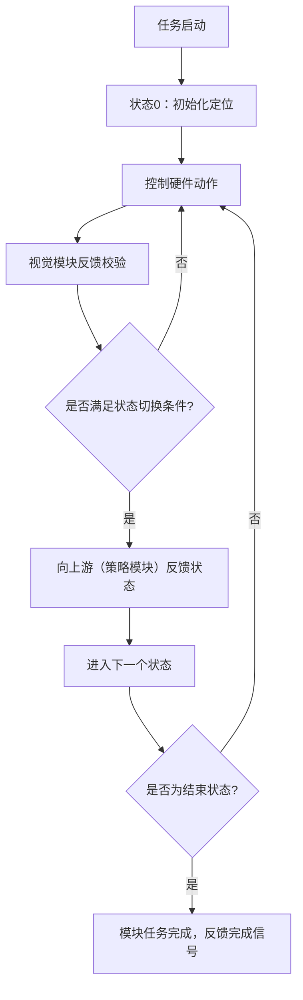
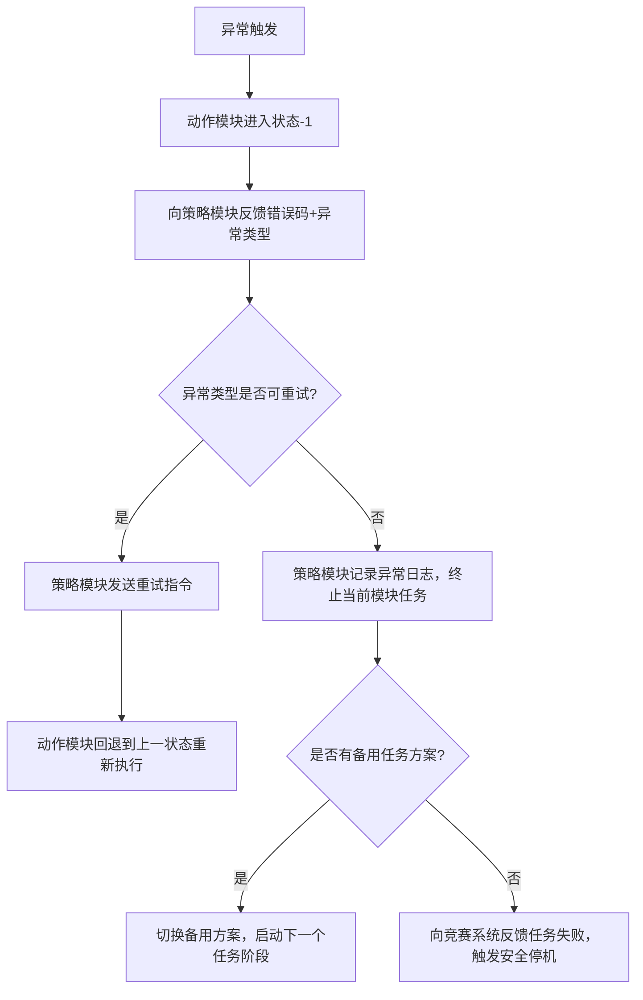

# RoboGame 机器人方块任务控制系统技术文档
## 1. 文档概述
### 1.1 文档目的
本文档为RoboGame竞赛中机器人方块收集-放置-搭建任务的**控制策略与执行系统**提供完整技术设计说明，明确系统架构、模块职责、状态流转逻辑、交互规则与异常处理机制，为算法实现、硬件调试与竞赛落地提供规范依据。

### 1.2 适用范围
本文档适用于RoboGame竞赛中以树莓派为主控的方块任务机器人，覆盖从环境感知、决策控制到动作执行的全流程控制逻辑，仅针对本次竞赛的方块类任务场景。

### 1.3 术语定义
| 术语 | 定义 |
|------|------|
| 树莓派策略模块 | 系统主控单元，运行核心决策算法，负责任务调度、状态机管理与模块协同控制 |
| 视觉模块 | 环境感知单元，负责图像采集、目标识别与位姿反馈，为决策提供环境数据 |
| 动作执行模块 | 包含收集方块、放置方块、搭建方块三个子模块，负责机械动作执行与状态反馈 |
| 有限状态机（FSM） | 控制任务流程的核心模型，通过状态切换管理任务阶段流转 |
| 状态码 | 定义任务执行阶段的标识（0/1/2/3/-1），用于状态流转与反馈 |


## 2. 系统整体架构
本系统采用**“感知-决策-执行-反馈”的分层闭环控制架构**，整体架构如下：

```mermaid
graph LR
    A[视觉模块<br/>(感知层)] -->|目标位置/位姿反馈| B[树莓派策略模块<br/>(决策层)]
    B -->|控制指令/目标参数| C[收集方块模块<br/>(执行层)]
    B -->|控制指令/目标参数| D[放置方块模块<br/>(执行层)]
    B -->|控制指令/目标参数| E[搭建方块模块<br/>(执行层)]
    C -->|执行状态/异常反馈| B
    D -->|执行状态/异常反馈| B
    E -->|执行状态/异常反馈| B
```

系统核心为树莓派策略模块，接收视觉模块的环境感知数据，基于任务阶段调度不同动作执行模块，同时接收执行模块的状态反馈，动态调整控制策略，形成闭环控制。


## 3. 核心模块详细设计
### 3.1 树莓派策略模块（决策层）
#### 3.1.1 核心功能
- 任务调度：根据竞赛任务阶段，按顺序调度“收集→放置→搭建”三个动作模块执行任务；
- 状态机管理：维护各动作模块的状态流转，判断状态切换条件，推进任务流程；
- 数据交互：接收视觉模块的目标信息与执行模块的状态反馈，输出控制指令；
- 异常处理：识别执行过程中的异常状态，触发重试、路径重规划或任务终止逻辑。

#### 3.1.2 工作逻辑
作为系统中枢，树莓派策略模块以**“任务阶段+状态机”双驱动模式**运行：
1.  初始化阶段：接收竞赛任务指令，初始化各模块通信，加载任务参数（方块位置、目标搭建点等）；
2.  任务调度阶段：按任务优先级依次启动收集、放置、搭建模块的状态机，单模块任务完成后自动触发下一个模块；
3.  闭环控制阶段：实时接收视觉模块的环境更新与执行模块的状态反馈，动态调整控制指令，确保动作精准执行。


### 3.2 视觉模块（感知层）
#### 3.2.1 核心功能
- 环境感知：实时采集竞赛场地图像，识别方块位置、目标搭建点、机器人自身位姿；
- 目标反馈：向树莓派策略模块输出目标坐标、方块状态（是否被抓取/放置）、导航参考信息；
- 状态校验：在动作执行过程中提供视觉反馈，辅助判断“是否到达位置”“动作是否成功”（如抓取是否成功、放置是否到位）。

#### 3.2.2 交互逻辑
视觉模块与树莓派策略模块为**双向数据交互**：
- 上行：向策略模块传输目标位置、位姿数据、状态校验结果；
- 下行：接收策略模块的指令，调整识别参数（如目标筛选范围、识别精度阈值）。


### 3.3 动作执行模块（执行层）
系统包含三个独立的动作执行模块，每个模块基于相同的有限状态机模型实现任务流程，模块间由树莓派策略模块调度协同。

#### 3.3.1 通用状态机模型（所有执行模块共用）
每个动作模块均采用以下状态流转逻辑：


#### 3.3.2 收集方块模块
| 状态码 | 状态名称 | 核心逻辑 | 输入 | 输出 | 切换条件 |
|--------|----------|----------|------|------|----------|
| 0 | 初始化定位 | 接收策略模块指令，通过视觉模块确定待收集方块的位置与导航目的地 | 任务指令、场地环境数据 | 目标位置坐标 | 成功识别目标方块位置，无遮挡 |
| 1 | 导航到目的地 | 基于路径规划算法控制机器人移动，向目标方块位置导航 | 目标位置坐标、实时位姿反馈 | 移动控制指令 | 机器人到达目标位置（位姿误差≤设定阈值） |
| 2 | 抓取方块 | 控制机械执行机构（如机械爪）执行抓取动作，通过视觉/传感器校验抓取结果 | 到达位置信号、视觉校验指令 | 抓取控制指令 | 视觉模块确认方块被稳定抓取 |
| 3 | 结束状态 | 收集任务完成，向策略模块反馈任务成功信号，等待下一级调度 | 抓取成功信号 | 任务完成反馈 | 抓取动作完成且校验通过 |
| -1 | 异常处理 | 处理导航失败、抓取失败、目标丢失等异常，向策略模块反馈错误码 | 异常触发信号 | 错误码、异常类型 | 任意状态下动作执行失败或校验不通过 |

#### 3.3.3 放置方块模块
| 状态码 | 状态名称 | 核心逻辑 | 输入 | 输出 | 切换条件 |
|--------|----------|----------|------|------|----------|
| 0 | 初始化定位 | 接收策略模块指令，通过视觉模块确定方块放置位置（如搭建点/中转点） | 收集完成信号、目标放置点数据 | 放置位置坐标 | 成功识别目标放置点，无遮挡 |
| 1 | 导航到目的地 | 控制机器人携带方块向放置位置导航，保持方块稳定 | 放置位置坐标、实时位姿反馈 | 移动控制指令 | 机器人到达放置位置（位姿误差≤设定阈值） |
| 2 | 放置方块 | 控制机械执行机构释放方块，通过视觉校验方块是否放置到位 | 到达位置信号、视觉校验指令 | 放置控制指令 | 视觉模块确认方块放置在目标位置 |
| 3 | 结束状态 | 放置任务完成，向策略模块反馈任务成功信号，触发搭建模块调度 | 放置成功信号 | 任务完成反馈 | 放置动作完成且校验通过 |
| -1 | 异常处理 | 处理导航失败、方块掉落、放置位置偏移等异常，反馈错误码 | 异常触发信号 | 错误码、异常类型 | 任意状态下动作执行失败或校验不通过 |

#### 3.3.4 搭建方块模块
| 状态码 | 状态名称 | 核心逻辑 | 输入 | 输出 | 切换条件 |
|--------|----------|----------|------|------|----------|
| 0 | 初始化定位 | 接收策略模块指令，通过视觉模块确定搭建目标位置（如多层搭建的目标层） | 放置完成信号、搭建目标数据 | 搭建位置坐标 | 成功识别搭建目标位置，无遮挡 |
| 1 | 导航到目的地 | 控制机器人携带方块向搭建位置导航，调整姿态适配搭建动作 | 搭建位置坐标、实时位姿反馈 | 移动控制指令 | 机器人到达搭建位置，姿态满足搭建要求 |
| 2 | 放置方块到指定位置 | 控制机械执行机构将方块放置到搭建目标位置，校验搭建精度 | 到达位置信号、视觉校验指令 | 搭建控制指令 | 视觉模块确认方块与搭建结构对齐，放置到位 |
| 3 | 结束状态 | 搭建任务完成，向策略模块反馈最终任务成功信号 | 搭建成功信号 | 任务完成反馈 | 搭建动作完成且校验通过 |
| -1 | 异常处理 | 处理搭建位置偏移、方块掉落、结构碰撞等异常，反馈错误码 | 异常触发信号 | 错误码、异常类型 | 任意状态下动作执行失败或校验不通过 |


## 4. 模块间交互与数据流
### 4.1 正向控制流（决策层→执行层）
1.  树莓派策略模块向动作执行模块发送**任务启动指令**，包含目标位置、动作参数等；
2.  动作执行模块进入状态机流程，向硬件输出控制指令（如电机运动、机械爪开合）；
3.  视觉模块同步接收策略模块的校验指令，实时反馈动作执行结果。

### 4.2 反向反馈流（执行层→决策层）
1.  动作执行模块在每个状态结束后，向策略模块反馈**状态码+执行结果**；
2.  若状态码为3（结束），策略模块触发下一个动作模块的调度；
3.  若状态码为-1（异常），策略模块根据异常类型执行重试、路径重规划或任务终止。

### 4.3 视觉数据交互流
- 视觉模块以固定频率向策略模块发送环境感知数据（目标坐标、位姿信息）；
- 策略模块根据当前任务阶段，向视觉模块发送针对性识别指令（如“校验抓取状态”“识别搭建目标”），优化识别效率。


## 5. 异常处理机制
### 5.1 异常类型定义
| 异常类型 | 触发场景 | 处理逻辑 |
|----------|----------|----------|
| 视觉感知异常 | 目标丢失、识别超时、识别精度不达标 | 策略模块触发重试指令，调整识别参数（如扩大识别范围），重试3次仍失败则终止当前模块任务 |
| 导航运动异常 | 路径堵塞、位姿误差过大、电机故障 | 动作模块进入异常状态，向策略模块反馈错误码，策略模块重新规划路径或触发紧急停止 |
| 机械动作异常 | 抓取失败、方块掉落、搭建碰撞 | 动作模块终止当前动作，回退到上一个状态（如导航状态），重新执行动作；若多次失败则反馈异常，由策略模块决策是否更换任务方案 |

### 5.2 异常处理流程



## 6. 系统整体工作流程
1.  **系统初始化**：树莓派策略模块、视觉模块、动作执行模块上电初始化，完成通信连接与参数加载；
2.  **任务启动**：接收竞赛任务指令，树莓派策略模块调度收集方块模块启动状态机；
3.  **收集阶段**：收集模块按状态0→1→2→3执行任务，完成后向策略模块反馈成功信号；
4.  **放置阶段**：策略模块调度放置方块模块启动状态机，接收收集模块的方块位置数据，执行放置任务；
5.  **搭建阶段**：放置模块完成后，策略模块调度搭建方块模块，执行方块搭建任务；
6.  **任务结束**：搭建模块反馈结束状态，策略模块向竞赛系统发送任务完成信号，机器人进入安全待机状态；
7.  **异常处理**：任意阶段触发异常时，按5.2节流程执行异常处理，确保机器人安全可控。


## 7. 接口与通信设计
### 7.1 通信接口定义
| 模块间接口 | 通信方式 | 数据格式 | 传输频率 |
|------------|----------|----------|----------|
| 树莓派↔视觉模块 | USB/串口（UART） | JSON格式：包含目标坐标、识别状态、校验结果 | 10Hz（可调） |
| 树莓派↔动作执行模块 | UART/I2C/CAN总线 | 自定义二进制协议：指令码+参数+校验位 | 50Hz（控制指令）/10Hz（状态反馈） |

### 7.2 核心数据协议示例
#### 7.2.1 视觉模块→策略模块（目标位置反馈）
```json
{
  "module": "vision",
  "timestamp": 1715000000,
  "target_type": "block", // 目标类型：block/place_point/build_point
  "coordinate": {"x": 120, "y": 80, "theta": 0.5}, // 目标坐标与角度
  "confidence": 0.95, // 识别置信度
  "status": "valid" // 状态：valid/invalid/lost
}
```

#### 7.2.2 策略模块→动作执行模块（任务启动指令）
```json
{
  "module": "collect_block",
  "cmd": "start_task",
  "target_pos": {"x": 120, "y": 80},
  "params": {"speed": 0.3, "grip_force": 5}, // 导航速度、抓取力度
  "timeout": 30 // 任务超时时间（秒）
}
```

#### 7.2.3 动作执行模块→策略模块（状态反馈）
```json
{
  "module": "collect_block",
  "status_code": 2, // 状态码：0/1/2/3/-1
  "result": "success", // 结果：success/failed
  "error_code": 0, // 错误码：0=无错误，非0为异常类型
  "timestamp": 1715000010
}
```


## 8. 测试与验证方案
### 8.1 单元测试
- 视觉模块：测试不同光照、遮挡条件下的目标识别准确率，确保置信度≥90%；
- 动作执行模块：单独测试导航精度（误差≤±5mm）、抓取/放置成功率（≥95%）；
- 状态机逻辑：模拟状态切换场景，验证状态流转的正确性与异常处理逻辑。

### 8.2 集成测试
- 模块联调测试：验证“视觉识别→策略决策→动作执行→状态反馈”的闭环流程，确保数据交互无丢失、指令无延迟；
- 全流程测试：在模拟竞赛场地中执行完整的“收集-放置-搭建”任务，记录任务完成时间与成功率。

### 8.3 现场调试优化
- 视觉参数调优：根据竞赛场地光照、方块颜色调整识别阈值，提升识别稳定性；
- 导航参数调优：优化路径规划算法，适配场地障碍物分布，减少导航误差；
- 异常场景模拟：模拟目标丢失、导航堵塞等场景，验证异常处理逻辑的有效性。


## 9. 附录：状态码与错误码定义
### 9.1 状态码定义
| 状态码 | 含义 |
|--------|------|
| 0 | 初始化定位状态 |
| 1 | 导航到目标位置状态 |
| 2 | 动作执行状态（抓取/放置/搭建） |
| 3 | 模块任务结束状态 |
| -1 | 异常处理状态 |

### 9.2 错误码定义
| 错误码 | 含义 |
|--------|------|
| 0 | 无错误，执行正常 |
| 1 | 视觉识别失败（目标丢失/超时） |
| 2 | 导航失败（路径堵塞/位姿误差过大） |
| 3 | 机械动作失败（抓取/放置/搭建失败） |
| 4 | 通信异常（模块间数据传输中断） |
| 5 | 任务超时 |

