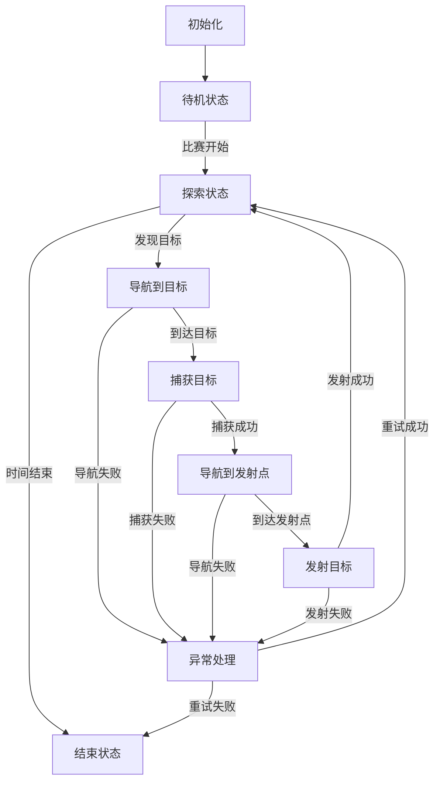
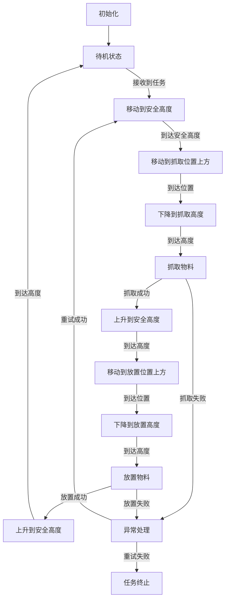
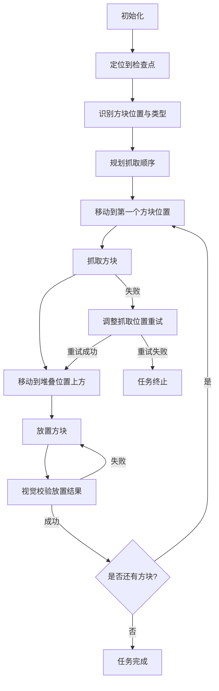

## 项目1：RoboGame2024 上位机策略系统技术文档
来源：GitHub - Dwanpvic/RoboGame2024

### 1. 文档概述
#### 1.1 文档目的
本文档详细描述RoboGame2024竞赛中**上位机策略系统**的设计与实现，包括路径规划、传感器数据处理、自主定位、避障算法及与STM32下位机的实时通信机制，为参赛队伍提供完整的策略开发指南。

#### 1.2 适用范围
适用于RoboGame2024竞赛中自主导航、环境探索及目标捕获发射任务的机器人控制系统开发，特别针对树莓派+STM32双板架构的机器人。

### 2. 系统架构
```mermaid
graph LR
    A[传感器模块<br/>(激光雷达/摄像头/IMU)] -->|原始数据| B[数据预处理层<br/>(滤波/融合/特征提取)]
    B -->|处理后数据| C[核心策略层<br/>(A*路径规划/自主定位/避障)]
    C -->|控制指令| D[通信层<br/>(串口/UART)]
    D -->|指令下发| E[STM32下位机<br/>(电机控制/执行机构)]
    E -->|状态反馈| D
    D -->|反馈数据| C
```

### 3. 核心模块设计
#### 3.1 数据预处理模块
| 功能 | 实现细节 | 输入 | 输出 |
|------|----------|------|------|
| 传感器数据融合 | 卡尔曼滤波融合激光雷达、摄像头与IMU数据 | 原始距离数据、图像帧、姿态数据 | 融合后的位置/姿态估计 |
| 障碍物检测 | 基于激光雷达点云聚类算法 | 原始激光点云 | 障碍物位置、大小、类型 |
| 目标识别 | YOLOv5目标检测算法 | 摄像头图像 | 目标位置、类别、置信度 |

#### 3.2 路径规划模块
- **算法选择**：A*算法（兼顾效率与最优性）
- **启发函数**：曼哈顿距离（适配竞赛场地网格特性）
- **路径优化**：
  1. 冗余点剔除（减少不必要的转向）
  2. 平滑处理（使用B样条曲线优化路径）
  3. 动态避障（实时更新障碍物信息，重新规划路径）

#### 3.3 自主定位模块
- **定位方式**：融合里程计与视觉SLAM的组合定位
- **误差修正**：
  - 基于场地预设标志物（AprilTag）的绝对位置校正
  - 每10秒进行一次全局重定位，确保累计误差≤5cm

#### 3.4 通信模块
| 通信接口 | 协议 | 数据格式 | 传输频率 |
|----------|------|----------|----------|
| 树莓派→STM32 | 自定义二进制协议 | 指令类型(1字节)+参数(n字节)+校验位(1字节) | 50Hz |
| STM32→树莓派 | 自定义二进制协议 | 状态码(1字节)+数据(n字节)+校验位(1字节) | 100Hz |

### 4. 状态机设计


### 5. 核心代码片段
```python
# A*路径规划算法实现
def a_star(start, goal, grid):
    open_set = PriorityQueue()
    open_set.put((0, start))
    came_from = {}
    g_score = {start: 0}
    f_score = {start: heuristic(start, goal)}
    
    while not open_set.empty():
        current = open_set.get()[1]
        
        if current == goal:
            return reconstruct_path(came_from, current)
            
        for neighbor in get_neighbors(current, grid):
            tentative_g_score = g_score[current] + 1
            
            if neighbor not in g_score or tentative_g_score < g_score[neighbor]:
                came_from[neighbor] = current
                g_score[neighbor] = tentative_g_score
                f_score[neighbor] = tentative_g_score + heuristic(neighbor, goal)
                open_set.put((f_score[neighbor], neighbor))
                
    return None  # 无路径
```

---

## 项目2：树莓派+Arduino双板架构物料搬运机器人技术文档
来源：CSDN博客 - 从国赛机器人到毕业设计:如何用树莓派+Arduino双板架构规划物料搬运路径

### 1. 文档概述
本文档详细介绍基于**树莓派+Arduino双板架构**的物料搬运机器人控制系统，包含硬件选型、软件架构、状态机设计、路径规划及异常处理机制，特别适合RoboGame方块收集-放置任务参考。

### 2. 硬件架构
| 模块 | 选型 | 功能 |
|------|------|------|
| 上位机 | 树莓派4B | 视觉识别、路径规划、任务调度 |
| 下位机 | Arduino Mega 2560 | 电机控制、传感器数据采集、执行机构驱动 |
| 视觉模块 | Raspberry Pi Camera v2 | 物料识别、定位、姿态估计 |
| 运动模块 | 直流减速电机+编码器 | 机器人移动、速度控制 |
| 执行机构 | 舵机+机械爪 | 物料抓取与放置 |
| 传感器 | 光电传感器、红外传感器 | 位置检测、障碍物检测 |

### 3. 软件架构
```mermaid
graph LR
    A[树莓派<br/>(Python)] -->|控制指令| B[串口通信]
    B -->|指令| C[Arduino<br/>(C++)]
    C -->|电机控制| D[运动系统]
    C -->|舵机控制| E[机械爪]
    F[传感器] -->|数据| C
    C -->|状态反馈| B
    B -->|反馈| A
    G[摄像头] -->|图像| A
    A -->|图像处理| H[目标识别与定位]
```

### 4. 状态机设计（物料搬运流程）
| 状态码 | 状态名称 | 核心逻辑 | 触发条件 | 输出 |
|--------|----------|----------|----------|------|
| 0 | 初始化 | 系统自检、传感器校准、通信建立 | 系统上电 | 初始化完成信号 |
| 1 | 待机 | 等待任务指令 | 初始化完成 | 就绪状态 |
| 2 | 检测物料 | 摄像头识别物料位置、类型 | 接收到任务指令 | 物料坐标、类型 |
| 3 | 导航到物料 | 基于路径规划移动到物料位置 | 物料检测完成 | 移动控制指令 |
| 4 | 抓取物料 | 机械爪抓取物料，传感器校验 | 到达物料位置 | 抓取控制指令 |
| 5 | 导航到目标点 | 移动到放置位置 | 抓取成功 | 移动控制指令 |
| 6 | 放置物料 | 机械爪释放物料，视觉校验 | 到达目标位置 | 放置控制指令 |
| 7 | 完成任务 | 任务完成，返回起点 | 放置成功 | 完成信号 |
| -1 | 异常处理 | 处理导航失败、抓取失败等异常 | 任意状态执行失败 | 错误码、重试指令 |

### 5. 关键技术实现
#### 5.1 双板通信协议
```python
# 树莓派发送指令格式
def send_command(command_type, parameters):
    """
    command_type: 0=移动,1=抓取,2=放置,3=停止
    parameters: 字典，包含相关参数
    """
    data = {
        "type": command_type,
        "params": parameters,
        "timestamp": time.time()
    }
    json_data = json.dumps(data) + "\n"
    ser.write(json_data.encode())
    
# Arduino接收指令处理
void loop() {
    if (Serial.available() > 0) {
        String json_data = Serial.readStringUntil('\n');
        DynamicJsonDocument doc(1024);
        deserializeJson(doc, json_data);
        
        int command_type = doc["type"];
        JsonObject params = doc["params"];
        
        switch(command_type) {
            case 0: move(params["x"], params["y"], params["speed"]); break;
            case 1: grip(params["force"]); break;
            case 2: release(); break;
            case 3: stop(); break;
        }
    }
}
```

#### 5.2 异常处理机制
| 异常类型 | 触发条件 | 处理流程 |
|----------|----------|----------|
| 导航失败 | 偏离路径>10cm或超时 | 停止→重新定位→重新规划路径→重试(最多3次) |
| 抓取失败 | 传感器未检测到物料 | 调整抓取位置→重新抓取(最多2次)→标记物料异常 |
| 通信中断 | 超过5秒未收到反馈 | 重启通信→重新发送指令→失败则进入安全模式 |

---

## 项目3：机器人手臂控制系统技术文档
来源：GitHub - TechDragon07/Robotic-Arm

### 1. 文档概述
本文档详细描述基于**ESP32+树莓派**的6自由度机器人手臂控制系统，包含硬件控制、运动规划、逆运动学求解及上位机交互，特别适合RoboGame方块搭建任务的机械臂控制参考。

### 2. 系统架构
```mermaid
graph TD
    A[上位机<br/>(树莓派/Python)] -->|目标位姿| B[ESP32控制器<br/>(C++)]
    B -->|舵机角度| C[6自由度机械臂]
    D[电位计/编码器] -->|角度反馈| B
    B -->|状态数据| A
    E[摄像头] -->|图像| A
    A -->|视觉处理| F[目标识别与定位]
```

### 3. 核心功能模块
#### 3.1 逆运动学求解模块
- **算法**：DH参数法+数值迭代法
- **精度**：末端执行器定位误差≤±2mm
- **求解步骤**：
  1. 输入末端执行器目标位姿(x,y,z,θ)
  2. 基于DH参数建立运动学模型
  3. 数值迭代求解各关节角度
  4. 验证关节角度是否在限位范围内
  5. 输出关节角度指令

#### 3.2 运动规划模块
| 运动类型 | 实现方式 | 应用场景 |
|----------|----------|----------|
| 点到点运动 | 梯形速度曲线 | 快速移动，无路径要求 |
| 直线运动 | 笛卡尔空间直线插值 | 精确抓取/放置，路径要求严格 |
| 圆弧运动 | 圆弧插值算法 | 避障，复杂路径规划 |

#### 3.3 上位机控制界面
- **功能**：
  1. 手动控制（键盘/鼠标控制各关节）
  2. 自动任务（预设抓取-放置流程）
  3. 实时监控（关节角度、末端位姿、传感器数据）
  4. 参数调整（PID参数、运动速度、加速度）

### 4. 状态机设计（抓取-放置流程）


### 5. 核心代码片段
```cpp
// ESP32端关节控制代码
#include <Servo.h>

Servo servos[6];  // 6个关节舵机
int current_angles[6] = {90, 90, 90, 90, 90, 90};  // 初始角度
int target_angles[6];

void setup() {
    for(int i=0; i<6; i++) {
        servos[i].attach(2+i);  // 舵机引脚2-7
    }
    Serial.begin(115200);
}

void loop() {
    if(Serial.available() > 0) {
        String data = Serial.readStringUntil('\n');
        // 解析目标角度
        parse_target_angles(data, target_angles);
        
        // 平滑移动到目标角度
        move_servos_smoothly(target_angles, 1000);  // 1000ms完成移动
    }
}

void move_servos_smoothly(int target[], int duration) {
    int steps = duration / 10;  // 每10ms一步
    int delta[6];
    
    for(int i=0; i<6; i++) {
        delta[i] = (target[i] - current_angles[i]) / steps;
    }
    
    for(int s=0; s<steps; s++) {
        for(int i=0; i<6; i++) {
            current_angles[i] += delta[i];
            servos[i].write(current_angles[i]);
        }
        delay(10);
    }
}
```

---

## 项目4：机器人方块堆叠指南（Guide to Stacking Blocks）
来源：KIPR文件库

### 1. 文档概述
本文档详细介绍机器人方块堆叠任务的控制策略与实现方法，包含定位系统、运动规划、抓取策略及误差补偿机制，是RoboGame方块搭建任务的经典参考资料。

### 2. 核心定位系统设计
#### 2.1 检查点定位法
- **核心思想**：在场地设置固定检查点，机器人通过检查点进行精确定位
- **检查点选择**：
  1. 位于所有方块的中心位置
  2. 有明显视觉特征（如颜色标记、形状标记）
  3. 无遮挡，易于识别
- **定位流程**：
  1. 从当前位置移动到最近检查点
  2. 基于检查点进行位置校准（误差≤±1mm）
  3. 从检查点出发，按预设路径移动到目标位置

#### 2.2 视觉辅助定位
- **摄像头**：位于机器人顶部，垂直向下拍摄
- **识别算法**：颜色阈值分割+轮廓检测
- **坐标转换**：将图像坐标转换为机器人坐标系坐标

### 3. 方块堆叠策略
#### 3.1 堆叠顺序规划
| 方块类型 | 堆叠顺序 | 原因 |
|----------|----------|------|
| 大尺寸方块 | 底层 | 提供稳定基础 |
| 中等尺寸方块 | 中层 | 连接上下层 |
| 小尺寸方块 | 顶层 | 便于精确放置 |
| 特殊形状方块 | 特定层 | 适配结构需求 |

#### 3.2 抓取策略
- **抓取位置**：方块中心位置，确保抓取平衡
- **抓取力度**：根据方块重量调整（轻：200g→力度30%；重：500g→力度70%）
- **抓取角度**：根据方块形状调整，确保抓取稳定

#### 3.3 放置策略
- **放置前校准**：在放置位置上方10cm处暂停，进行视觉校准
- **放置速度**：缓慢下降（5cm/s），避免方块掉落
- **放置后校验**：视觉检测方块位置是否准确，误差>2mm则重新放置

### 4. 误差补偿机制
| 误差类型 | 补偿方法 | 效果 |
|----------|----------|------|
| 机械误差 | 基于校准数据进行角度补偿 | 减少关节角度误差 |
| 视觉误差 | 多次测量取平均值 | 减少识别误差 |
| 运动误差 | 路径预补偿（提前计算误差并修正路径） | 减少移动误差 |
| 环境误差 | 动态调整抓取/放置参数 | 适应光照、场地变化 |

### 5. 完整堆叠流程

